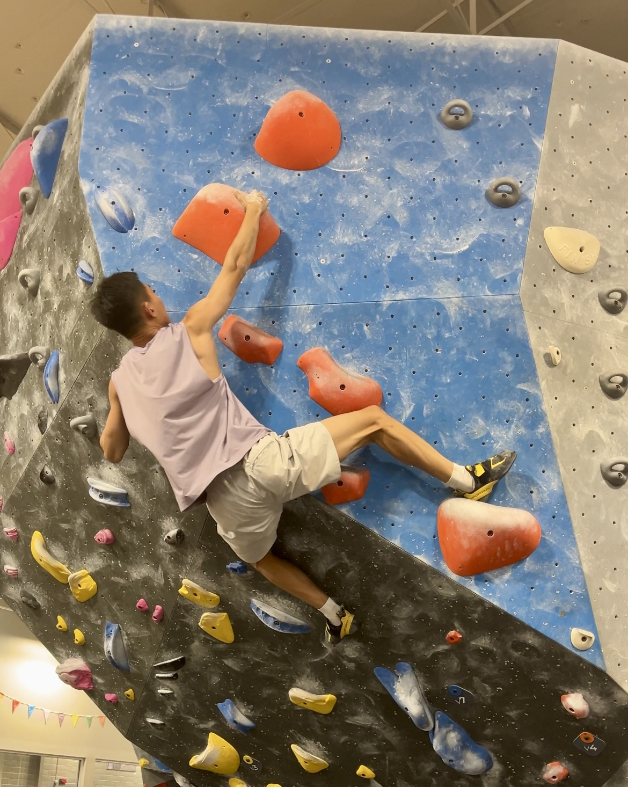
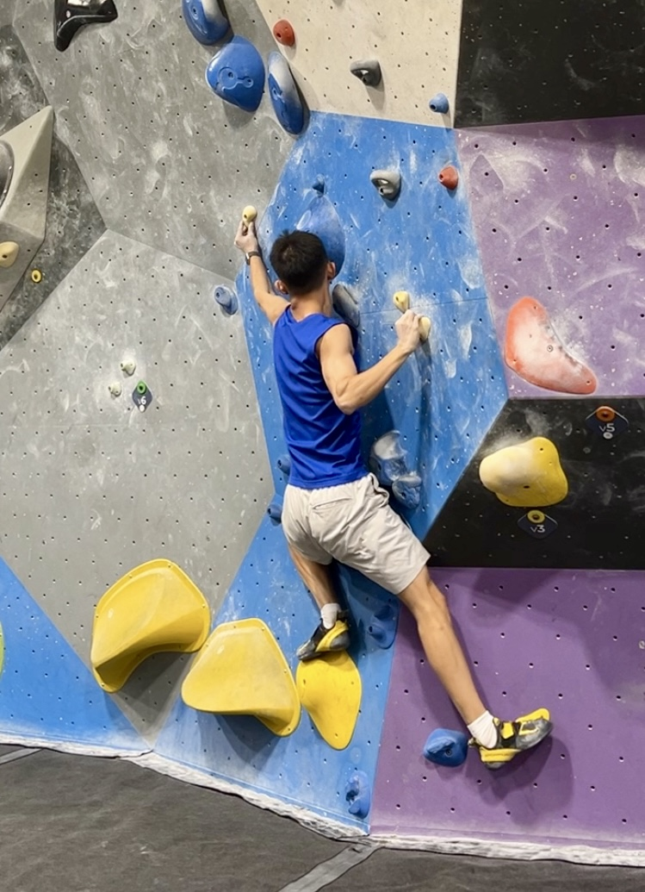

## Bio

Hello everyone! I'm Moran Guo, a current ScM student studying biostatistics at [Johns Hopkins Bloomberg School of Public Health](https://www.jhsph.edu). I graduated from [University of Rochester](https://rochester.edu) with a B.S. in Biological Sciences: Computational Biology (Magna Cum Laude) and minors in Mathematics & Japanese. I studied protein coevolution, protein folding, and utilized AlphaFold & Bayesian Graphic Model to investigate correlated mutations during my last two years of my undergraduate. Moving forward, I'm willing to explore all possibilities in the field of biostatistics. I particularly found causal inference and Bayesian methods interesting.

Outside of academics, I'm also a huge fan to rock climbing (with a bouldering focus) & fitness. Actually – I was recovering from a moderate to severe ankle sprain because of it :( Besides that, I also enjoy pop Japanese culture, electronic music and watching tennis. In the near future, I might consider playing squash or golf (or both).

 

## Education

**Johns Hopkins University, Bloomberg School of Public Health** \| Baltimore, MD

ScM in Biostatistics \| August 2024 - May 2026\* *Anticipated*

**University of Rochester** \| Rochester, NY

B.S. in Biological Sciences: Computational Biology \| February 2021 - May 2024

 

## Language & Programming Language

Chinese (Native), English (Fluent), Japanese (Advanced Intermediate w/ JLPT N3)

Python (Advanced), R (Advanced), Bash (Advanced), LaTeX (Advanced), SAS (Basic), SQL (Currently studying)

 

## Some Pictures

| {width="350"} | {width="350" height="439"} |
|:--------------------------------:|:---------------------------------------------:|

*I practice bouldering 4 times a week \@ [Movement Hampden](https://movementgyms.com/hampden/)*. *If you are also into climbing,*  *we could climb together! (I need some time to recover from my sprained ankle, so maybe in two weeks.)*

| {width="350"} | {width="350"} |
|:--------------------------------:|:---------------------------------------------:|

*Left: Osaka Castle Park（大阪城公園）, Right: Fushimi Inari Taisha Shrine （伏見稲荷大社） July 2024*
